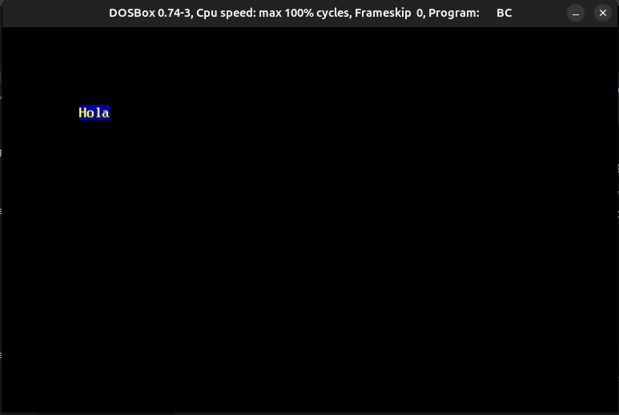
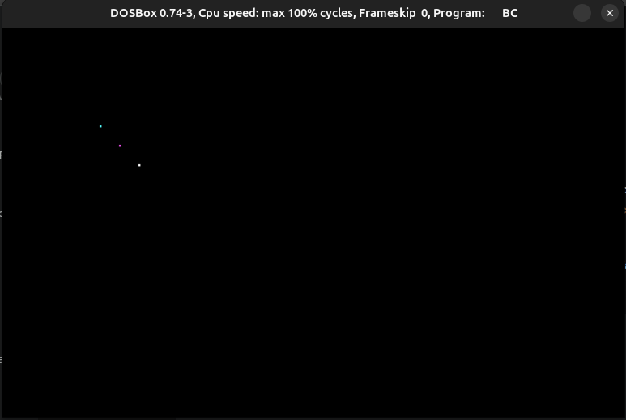
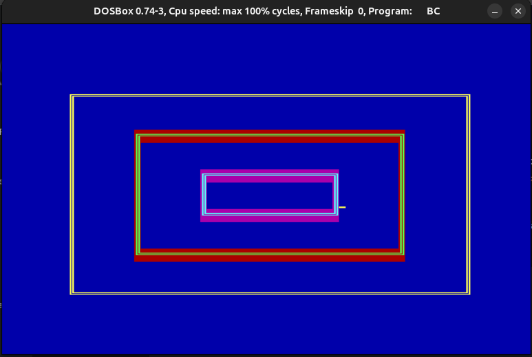
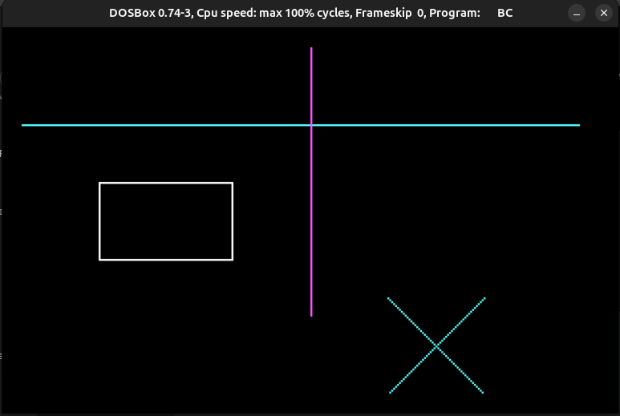
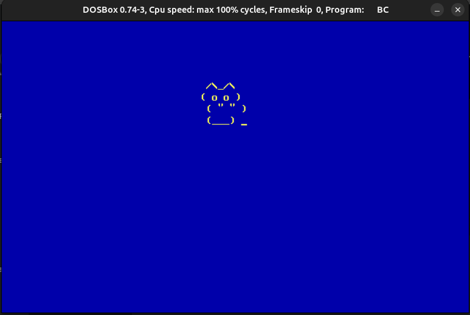

# Práctica 1: Entrada/Salida mediante Interrupciones

**Autores:** Inés Prados y Darío Ortega  
**Asignatura:** Programación de Dispositivos e Interfaz de Hardware (PDIH)  

---

## 1. Introducción y Objetivos
El objetivo de esta práctica es la creación de una librería de bajo nivel en C que permita gestionar la entrada y salida de un sistema MS-DOS mediante llamadas directas a las interrupciones de la BIOS y del DOS. Se ha hecho especial hincapié en el control del hardware de vídeo (Int 10h) y teclado (Int 16h / 21h).

## 2. Funciones de la Librería (`mi_io.c`)
Se han implementado satisfactoriamente las 10 funciones requeridas en los requisitos mínimos:

| Función | Propósito | Registro/Int |
| :--- | :--- | :--- |
| `gotoxy` | Posicionamiento absoluto del cursor. | Int 10h, AH=02h |
| `setcursortype` | Modificación de visibilidad y grosor. | Int 10h, AH=01h |
| `setvideomode` | Cambio entre modo texto (03h) y gráfico (04h). | Int 10h, AH=00h |
| `getvideomode` | Consulta del estado actual del adaptador. | Int 10h, AH=0Fh |
| `textcolor` | Gestión de colores de primer plano. | Atributo de bit |
| `textbackground` | Gestión de colores de fondo. | Atributo de bit |
| `clrscr` | Limpieza de pantalla mediante scroll. | Int 10h, AH=06h |
| `cputchar` | Salida de caracteres con atributo de color. | Int 10h, AH=09h |
| `getche` | Entrada de teclado con eco. | Int 21h, AH=01h |
| `pixel` | Dibujo de puntos en modo gráfico CGA. | Int 10h, AH=0Ch |

---

## 3. Demostración de Funcionamiento

### 3.1. Gestión de Colores y Texto
Demostración de la capacidad de escribir texto con diferentes atributos (amarillo sobre azul) y el correcto avance automático del cursor tras la corrección del bug de amontonamiento.

### 3.2. Píxeles Individuales en Modo Gráfico
Prueba inicial de la función `pixel` en modo CGA (04h), mostrando los tres píxeles concéntricos en cian, magenta y blanco.

### 3.3. Ejercicio Extra 1: Recuadros en Modo Texto
Función capaz de dibujar marcos concéntricos utilizando caracteres de la tabla ASCII extendida y gestión de colores de fondo.

### 3.4. Ejercicio Extra 2: Modo Gráfico Complejo CGA
Uso de bucles y la función `pixel` para dibujar líneas, rectángulos y formas geométricas sobre fondo negro.

### 3.5. Ejercicio Extra 3: ASCII Art
Representación artística de un felino utilizando caracteres específicos y posicionamiento dinámico de cursor.

---

## 4. Conclusión
La práctica ha permitido comprender cómo los lenguajes de alto nivel como C se comunican con el hardware subyacente mediante el uso de registros y uniones (`union REGS`), facilitando el control total sobre la interfaz de usuario en sistemas heredados.
