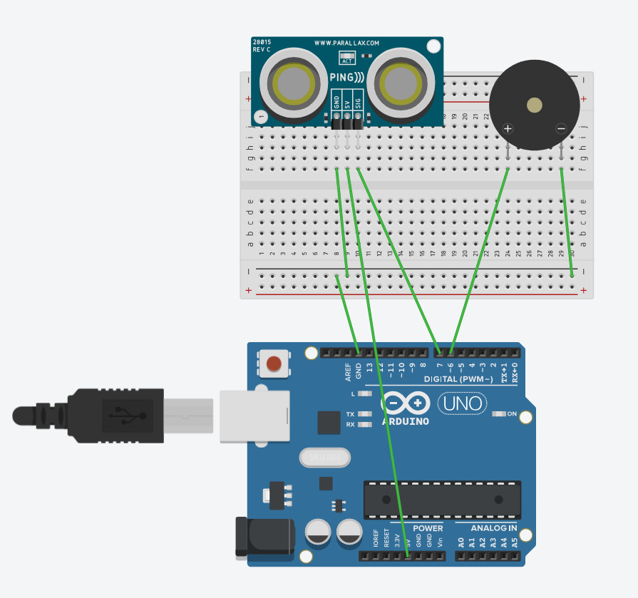
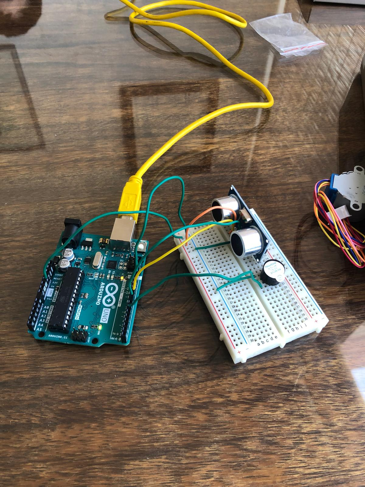
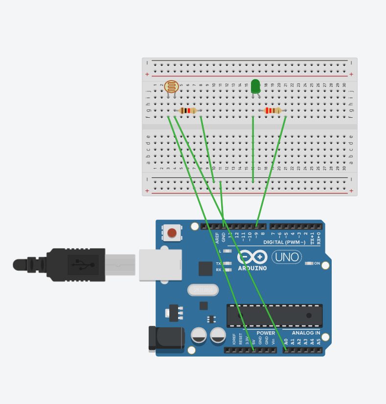

# Práctica 3: Experimentación con Arduino

**Autores:** Inés Prados y Darío Ortega  
**Asignatura:** Programación de Dispositivos e Interfaz de Hardware (PDIH)  
**Universidad de Granada**

---

## Objetivo

El objetivo principal de esta práctica es la configuración del dispositivo Arduino para realizar programas básicos de entrada/salida, utilizando componentes electrónicos como LEDs, pulsadores, sensores analógicos y motores.

---

## 1. Ejercicio 1: Secuencia de Tres LEDs

El objetivo de este proyecto es hacer parpadear tres LEDs (rojo, amarillo y verde) de forma secuencial, con un intervalo de 1.5 segundos entre cada encendido.

### Componentes Utilizados

| Componente | Cantidad | Descripción |
|---|---|---|
| Placa Arduino UNO | 1x | Microcontrolador principal |
| Breadboard | 1x | Placa de prototipado |
| LED Rojo | 1x | Conectado al pin digital 13 |
| LED Amarillo | 1x | Conectado al pin digital 12 |
| LED Verde | 1x | Conectado al pin digital 11 |
| Resistencia 220Ω–330Ω | 3x | Limitadoras de corriente para los LEDs |
| Cables de conexión | varios | Jumpers macho-macho |

### Esquema de Conexiones (Tinkercad)


### Código Fuente Documentado

```cpp
// --- DEFINICIÓN DE PINES ---
const int pinRojo    = 13;  // LED Rojo conectado al pin digital 13 (salida)
const int pinAmarillo = 12; // LED Amarillo conectado al pin digital 12 (salida)
const int pinVerde   = 11;  // LED Verde conectado al pin digital 11 (salida)

const int tiempoEspera = 1500; // Intervalo entre encendidos: 1.5 segundos

void setup() {
  // Configuramos los tres pines como salidas digitales
  pinMode(pinRojo,     OUTPUT);
  pinMode(pinAmarillo, OUTPUT);
  pinMode(pinVerde,    OUTPUT);
}

void loop() {
  // Encendemos el LED Rojo, esperamos y lo apagamos
  digitalWrite(pinRojo, HIGH);
  delay(tiempoEspera);
  digitalWrite(pinRojo, LOW);

  // Encendemos el LED Amarillo, esperamos y lo apagamos
  digitalWrite(pinAmarillo, HIGH);
  delay(tiempoEspera);
  digitalWrite(pinAmarillo, LOW);

  // Encendemos el LED Verde, esperamos y lo apagamos
  digitalWrite(pinVerde, HIGH);
  delay(tiempoEspera);
  digitalWrite(pinVerde, LOW);
}
```

### Demostración Física

Montaje físico funcionando en los tres estados de la secuencia:

| LED Rojo | LED Amarillo | LED Verde |
|:---:|:---:|:---:|
|  |  |  |

🎥 [Ver vídeo demostrativo del Ejercicio 1](ej1_tres_leds/video_ej1.mp4)

---

## 2. Ejercicio 2: LEDs con Interruptor

Modificación del circuito anterior para que la secuencia se detenga y únicamente el LED rojo quede encendido cuando se mantenga pulsado un botón conectado al pin digital 7.

### Componentes Utilizados

| Componente | Cantidad | Descripción |
|---|---|---|
| Placa Arduino UNO | 1x | Microcontrolador principal |
| Breadboard | 1x | Placa de prototipado |
| LED Rojo | 1x | Conectado al pin digital 13 |
| LED Amarillo | 1x | Conectado al pin digital 12 |
| LED Verde | 1x | Conectado al pin digital 11 |
| Resistencia 220Ω–330Ω | 3x | Limitadoras de corriente para los LEDs |
| Pulsador (Push Button) | 1x | Conectado al pin digital 7 con INPUT_PULLUP |
| Cables de conexión | varios | Jumpers macho-macho |

### Esquema de Conexiones (Tinkercad)


### Código Fuente Documentado

```cpp
// --- DEFINICIÓN DE PINES ---
const int led1 = 13;      // LED Rojo — pin digital 13 (salida)
const int led2 = 12;      // LED Amarillo — pin digital 12 (salida)
const int led3 = 11;      // LED Verde — pin digital 11 (salida)
const int pinBoton = 7;   // Pulsador — pin digital 7 (entrada con pull-up interno)

const int tiempoEspera = 300; // Intervalo de la secuencia en ms

void setup() {
  pinMode(led1, OUTPUT);
  pinMode(led2, OUTPUT);
  pinMode(led3, OUTPUT);

  // INPUT_PULLUP activa la resistencia interna de pull-up:
  // el pin lee HIGH en reposo y LOW cuando el botón se pulsa
  pinMode(pinBoton, INPUT_PULLUP);
}

void loop() {
  int estadoBoton = digitalRead(pinBoton); // LOW = pulsado, HIGH = libre

  if (estadoBoton == LOW) {
    // BOTÓN PULSADO: se apaga la secuencia y solo queda encendido el LED rojo
    digitalWrite(led1, HIGH);
    digitalWrite(led2, LOW);
    digitalWrite(led3, LOW);
  } else {
    // BOTÓN SIN PULSAR: secuencia normal de los tres LEDs
    digitalWrite(led2, HIGH);
    delay(tiempoEspera);
    digitalWrite(led2, LOW);

    digitalWrite(led3, HIGH);
    delay(tiempoEspera);
    digitalWrite(led3, LOW);

    digitalWrite(led1, HIGH);
    delay(tiempoEspera);
    digitalWrite(led1, LOW);
  }
}
```

### Demostración Física


🎥 [Ver vídeo demostrativo del Ejercicio 2](ej2_leds_interruptor/video_ej2.mp4)

---

## 3. Extra 1: Secuencia "Coche Fantástico"

Implementación de un efecto visual de barrido de ida y vuelta utilizando 4 LEDs consecutivos, similar al efecto del coche fantástico (KITT).

### Componentes Utilizados

| Componente | Cantidad | Descripción |
|---|---|---|
| Placa Arduino UNO | 1x | Microcontrolador principal |
| Breadboard | 1x | Placa de prototipado |
| LEDs | 4x | Conectados a los pines digitales 10, 11, 12 y 13 |
| Resistencias 220Ω–330Ω | 4x | Limitadoras de corriente |
| Cables de conexión | varios | Jumpers macho-macho |

### Código Fuente Documentado

```cpp
// Array con los pines de los LEDs ordenados de izquierda a derecha
// Pines: 10 (extremo izq.) → 11 → 12 → 13 (extremo der.)
int pinesLeds[] = {10, 11, 12, 13};
int numLeds = 4;
int tiempoEspera = 100; // ms entre cada paso del barrido

void setup() {
  // Configuramos todos los pines del array como salidas
  for (int i = 0; i < numLeds; i++) {
    pinMode(pinesLeds[i], OUTPUT);
  }
}

void loop() {
  // Recorrido de ida: de izquierda a derecha
  for (int i = 0; i < numLeds; i++) {
    digitalWrite(pinesLeds[i], HIGH);
    delay(tiempoEspera);
    digitalWrite(pinesLeds[i], LOW);
  }

  // Recorrido de vuelta: de derecha a izquierda
  // (evitando repetir los LEDs de los extremos para un efecto continuo)
  for (int i = numLeds - 2; i > 0; i--) {
    digitalWrite(pinesLeds[i], HIGH);
    delay(tiempoEspera);
    digitalWrite(pinesLeds[i], LOW);
  }
}
```

### Demostración Física


🎥 [Ver vídeo demostrativo del Extra 1](extra1_coche_fantastico/video_extra1.mp4)

---

## 4. Extra 2: Detector de Distancia (Ultrasonidos)

Uso del sensor HC-SR04 para calcular la distancia a un objeto y emitir pitidos con un buzzer cuya frecuencia varía según la distancia detectada.

### Componentes Utilizados

| Componente | Cantidad | Descripción |
|---|---|---|
| Placa Arduino UNO | 1x | Microcontrolador principal |
| Breadboard | 1x | Placa de prototipado |
| Sensor HC-SR04 | 1x | Sensor de ultrasonidos (Trigger: pin 9, Echo: pin 8) |
| Buzzer piezoeléctrico | 1x | Emisor de sonido (pin 7) |
| Cables de conexión | varios | Jumpers macho-macho |

### Esquema de Conexiones (Tinkercad)



### Código Fuente Documentado

```cpp
// --- DEFINICIÓN DE PINES ---
const int pinTrigger = 9; // Pin de disparo del sensor HC-SR04 (salida)
const int pinEcho    = 8; // Pin de recepción del sensor HC-SR04 (entrada)
const int pinBuzzer  = 7; // Pin del buzzer piezoeléctrico (salida)

long duracion;     // Duración del pulso de eco en microsegundos
int distancia;     // Distancia calculada en centímetros

void setup() {
  pinMode(pinTrigger, OUTPUT);
  pinMode(pinEcho,    INPUT);
  pinMode(pinBuzzer,  OUTPUT);
  Serial.begin(9600); // Monitor serie para depuración
}

void loop() {
  // Generamos un pulso ultrasónico de 10 µs en el Trigger
  digitalWrite(pinTrigger, LOW);
  delayMicroseconds(2);
  digitalWrite(pinTrigger, HIGH);
  delayMicroseconds(10);
  digitalWrite(pinTrigger, LOW);

  // Medimos el tiempo que tarda el eco en regresar
  duracion = pulseIn(pinEcho, HIGH);

  // Calculamos la distancia: velocidad del sonido ≈ 343 m/s → 29.1 µs/cm (ida y vuelta / 2)
  distancia = duracion / 58;

  Serial.print("Distancia: ");
  Serial.print(distancia);
  Serial.println(" cm");

  // Cuanto menor es la distancia, más rápido suena el buzzer
  if (distancia < 10) {
    tone(pinBuzzer, 1000, 100);  // Pitido rápido cuando está muy cerca
    delay(150);
  } else if (distancia < 30) {
    tone(pinBuzzer, 800, 200);   // Pitido medio a distancia intermedia
    delay(300);
  } else {
    noTone(pinBuzzer);           // Sin sonido si está lejos
    delay(500);
  }
}
```

### Demostración Física



🎥 [Ver vídeo demostrativo del Extra 2](extra2_ultrasonidos/video_extra2.mp4)

---

## 5. Extra 3: Fotosensor Automático (Farola)

Uso de una fotorresistencia (LDR) y un divisor de tensión para detectar niveles de oscuridad y activar un LED de forma automática, simulando el comportamiento de una farola.

### Componentes Utilizados

| Componente | Cantidad | Descripción |
|---|---|---|
| Placa Arduino UNO | 1x | Microcontrolador principal |
| Breadboard | 1x | Placa de prototipado |
| Fotorresistencia (LDR) | 1x | Sensor de luz — divisor de tensión con pin A0 |
| Resistencia 10kΩ | 1x | Resistencia de pull-down para el divisor de tensión |
| LED | 1x | Indicador luminoso — pin digital 9 |
| Resistencia 220Ω | 1x | Limitadora de corriente del LED |
| Cables de conexión | varios | Jumpers macho-macho |

### Esquema de Conexiones (Tinkercad)



### Código Fuente Documentado

```cpp
// --- DEFINICIÓN DE PINES ---
const int pinLDR = A0;  // Pin analógico de lectura del LDR (entrada, rango 0–1023)
const int pinLed = 9;   // Pin digital del LED indicador (salida)

// Umbral ajustado experimentalmente según la luz ambiente del laboratorio.
// Por debajo de este valor se considera "oscuro" y se enciende el LED.
const int umbralOscuridad = 600;

void setup() {
  pinMode(pinLed, OUTPUT);
  Serial.begin(9600); // Abrimos el monitor serie para calibrar el umbral
}

void loop() {
  int nivelLuz = analogRead(pinLDR); // Leemos el nivel de luz (0 = oscuro, 1023 = máx. luz)

  Serial.print("Nivel de luz: ");
  Serial.println(nivelLuz);

  // Si el nivel de luz baja del umbral → simulamos que es de noche → encendemos el LED
  if (nivelLuz < umbralOscuridad) {
    digitalWrite(pinLed, HIGH);
  } else {
    digitalWrite(pinLed, LOW);
  }

  delay(100); // Pequeña pausa para estabilizar las lecturas
}
```

### Demostración Física

🎥 [Ver vídeo demostrativo del Extra 3](extra3_fotosensor/video_extra3.mp4)

---

## 6. Extra 4: Control de Motor DC con PWM

Activación progresiva de un motor de corriente continua usando señales PWM y un transistor NPN para proteger la placa Arduino de la corriente del motor.

### Componentes Utilizados

| Componente | Cantidad | Descripción |
|---|---|---|
| Placa Arduino UNO | 1x | Microcontrolador principal |
| Breadboard | 1x | Placa de prototipado |
| Motor DC | 1x | Motor de corriente continua |
| Transistor NPN PN2222 | 1x | Actúa como interruptor electrónico para el motor |
| Resistencia 330Ω | 1x | Limita la corriente en la base del transistor |
| Diodo 1N4007 | 1x | Diodo de protección contra la corriente inversa del motor |
| Cables de conexión | varios | Jumpers macho-macho |

### Esquema de Conexiones (Tinkercad)


### Código Fuente Documentado

```cpp
// --- DEFINICIÓN DE PINES ---
// Pin 9 tiene capacidad PWM (~), necesario para analogWrite()
const int pinMotor = 9; // Señal PWM hacia la base del transistor (salida)

void setup() {
  pinMode(pinMotor, OUTPUT);
}

void loop() {
  // --- ACELERACIÓN GRADUAL ---
  // Aumentamos el ciclo de trabajo (duty cycle) de 0 a 255
  // analogWrite(pin, 0) = motor parado | analogWrite(pin, 255) = velocidad máxima
  for (int velocidad = 0; velocidad <= 255; velocidad++) {
    analogWrite(pinMotor, velocidad);
    delay(15); // Pequeña pausa para suavizar la rampa de aceleración
  }

  delay(2000); // Mantenemos la velocidad máxima durante 2 segundos

  // --- FRENADO PROGRESIVO ---
  // Reducimos el ciclo de trabajo de 255 a 0
  for (int velocidad = 255; velocidad >= 0; velocidad--) {
    analogWrite(pinMotor, velocidad);
    delay(15);
  }

  delay(2000); // El motor permanece parado 2 segundos antes de reiniciar
}
```

### Demostración Física


🎥 [Ver vídeo demostrativo del Extra 4](extra4_motor/video_extra4.mp4)

---

*Práctica realizada con Arduino UNO y simulación previa en [Tinkercad Circuits](https://www.tinkercad.com/circuits).*
